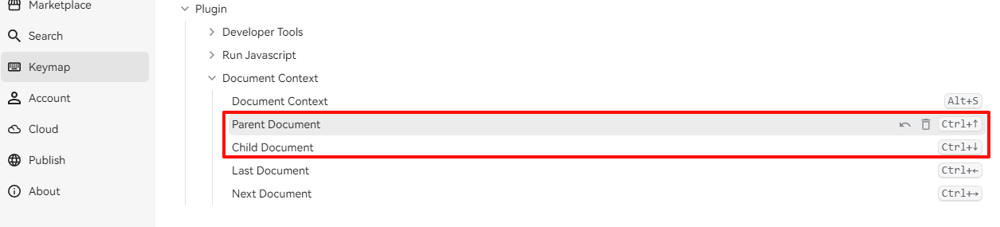

## 文档上下文插件

本插件提供了快速显示文档在文档树中上下文的功能。用户可以通过快捷键 Alt+S 来触发该插件。

- 显示文档路径：展示当前文档在文档树中的路径。
- 聚焦跳转：提供快速跳转到文档在文档树的所在位置。
- 显示上级文档：展示当前文档的上级文档。
- 显示子文档：展示当前文档的子文档列表。
- 显示同级文档：展示与当前文档同级的其他文档列表。
- 显示文档大纲：展示当前文档的标题大纲，并可以点击跳转

### 快捷键跳转

> 默认关闭，需要在设置中打开

- **父子文档快捷键**：使用 `Ctrl+↑` 跳转到父文档，`Ctrl+↓` 跳转到子文档（会覆盖 SiYuan 默认的 Expand/Collapse 快捷键）。
- **同级文档快捷键**：使用 `Ctrl+←` 跳转到前一篇文档，`Ctrl+→` 跳转到后一篇文档。
- **频率控制**：开启后，若文档切换间隔时间过短，自动关闭上一个文档，从而防止在连续使用快捷键的过程中打开过多的文档。

#### 注意!

* 默认的 Ctrl+↑ 和 Ctrl+↓ 为思源内置快捷键，所以插件会强制性覆盖思源的这两个默认快捷键
* 如果你想要继续使用思源内置的这两个快捷键，你可以:
  1. 在设置中关闭**父子文档快捷键**
  2. 或者在设置中关闭**覆盖默认 Ctrl+↑ 和 Ctrl+↓**；然后在思源的快捷键设置中为 "Parent Document" 和 "Child Document" 指定你喜欢的快捷键

